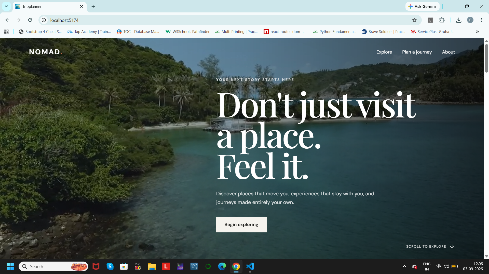
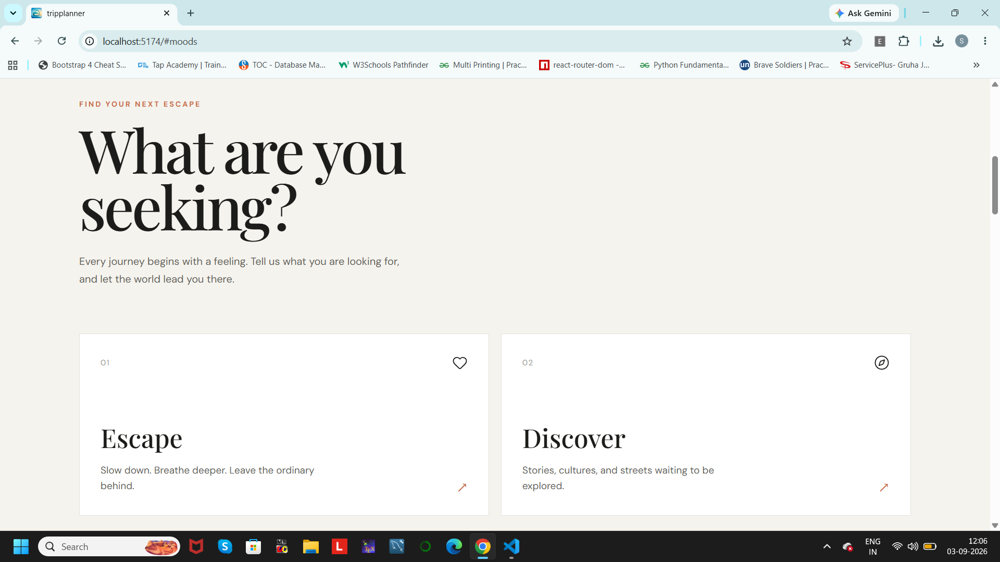
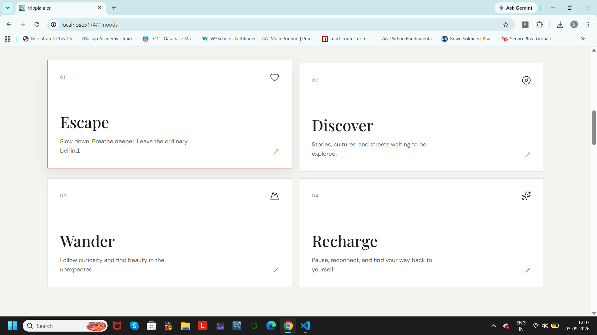
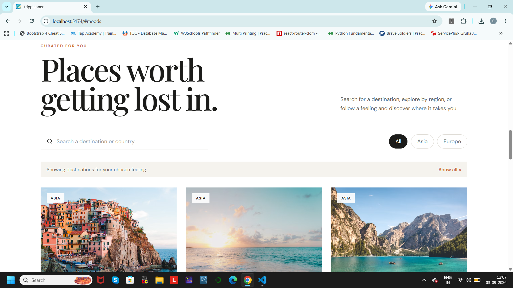
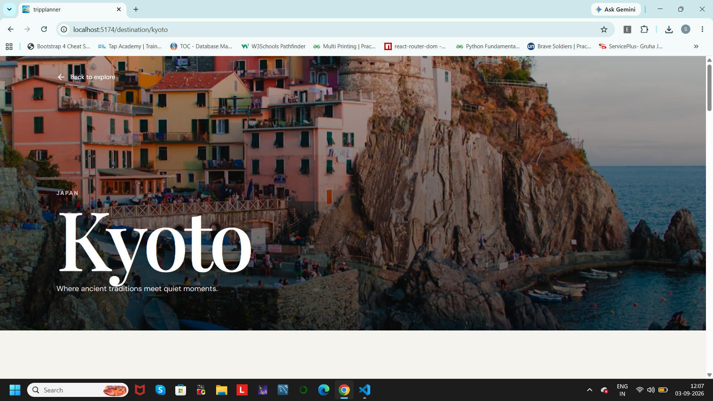
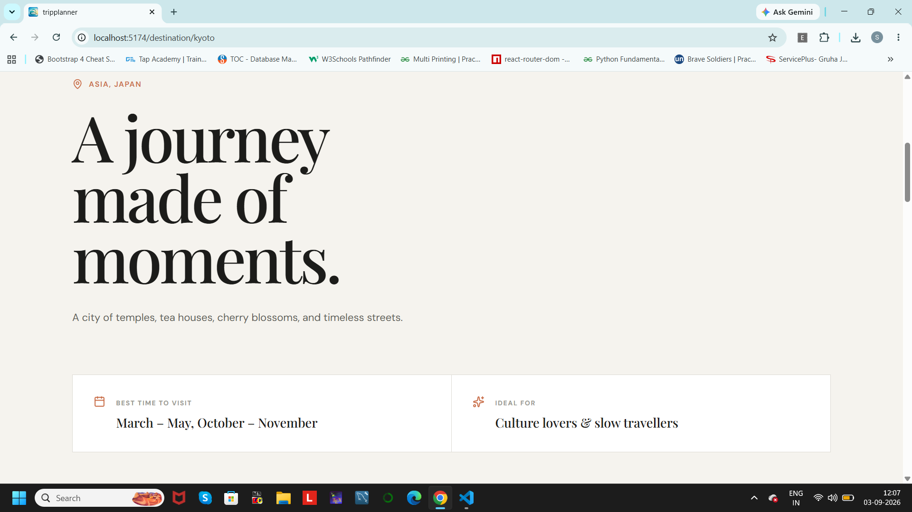
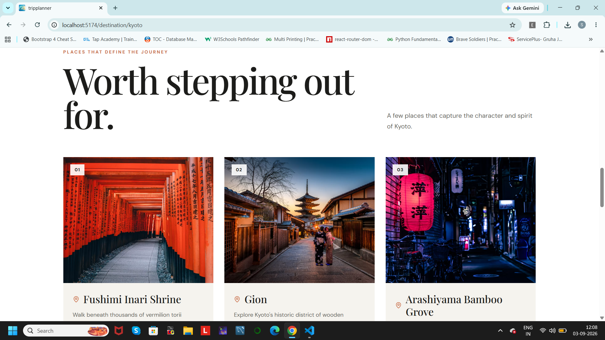
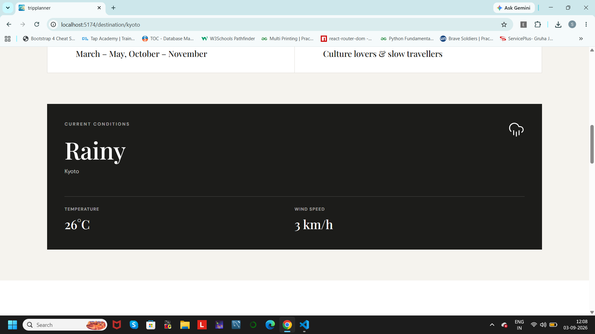
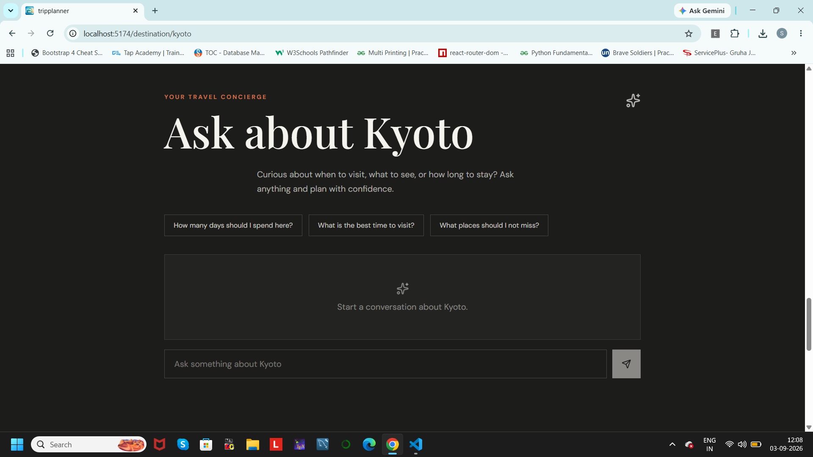
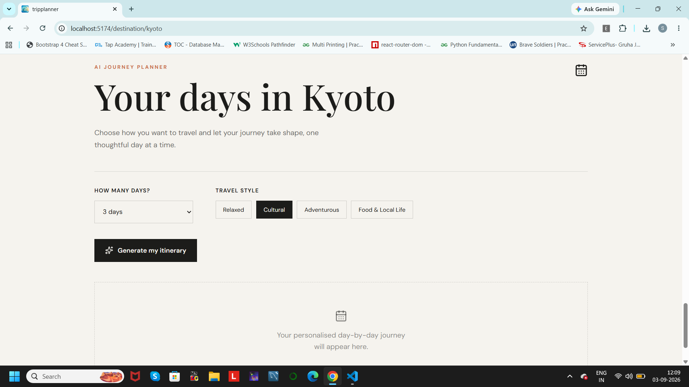

# NOMAD. — AI Trip Planner

NOMAD. is a responsive AI-powered travel planning web application that helps users discover destinations, explore places worth visiting, check real-time weather, and create personalised day-by-day travel itineraries.

The project brings destination discovery, location awareness, weather information, AI assistance, and itinerary generation together in one experience.

## ✨ Features

### 🌍 Destination Explorer

* Browse destinations based on different travel moods.
* Search and filter destinations.
* View dedicated destination pages with useful travel information.
* Explore famous places and highlights for each destination.

### 📍 Location Awareness

* Use the browser's current location.
* Search for a city or region manually.
* Save the selected location locally for a more personalised experience.

### ☀️ Real-Time Weather

* View current weather conditions for destinations.
* Displays:

  * Temperature
  * Weather condition
  * Wind speed
* Weather data is fetched dynamically using Open-Meteo.

### 🤖 AI Travel Assistant

* Ask questions about destinations through the built-in AI assistant.
* Get travel-related suggestions and information without leaving the application.
* Powered by the Groq API.

### 🗓️ AI Itinerary Planner

* Generate a personalised itinerary for a destination.
* Select trip preferences and trip duration.
* Receive a structured day-by-day travel plan instead of an unformatted chat response.

### 🖼️ Destination & Place Imagery

* Destination and famous-place imagery uses Unsplash-hosted images.
* Images are used throughout the application to make destination discovery more visual and engaging.

### 📱 Responsive Design

Designed to work across:

* Mobile phones
* Tablets
* Laptops
* Desktop screens

The interface adapts its layout, spacing, navigation, cards, forms, and content for different screen sizes.

### 🎨 Interaction & Motion

* Smooth scrolling between sections.
* Responsive navigation menu.
* Subtle Framer Motion animations.
* Interactive destination filters and cards.
* Loading, empty, and error states for API-driven features.

---

## 🛠️ Tech Stack

### Frontend

* React
* JavaScript (ES6+)
* HTML5
* CSS3
* Tailwind CSS
* React Router
* Framer Motion
* Lucide React

### APIs & Services

* **Open-Meteo** — weather data and location geocoding
* **Groq API** — AI travel assistant and itinerary generation
* **Unsplash** — destination and travel imagery
* **Vercel** — deployment and serverless API functions

### Development Tools

* Vite
* Git
* GitHub
* VS Code

---

## 🏗️ Project Structure

```text
NOMAD/
├── api/
│   ├── ai.js
│   └── images.js
│
├── public/
│
├── screenshots/
│   ├── landing_page.png
│   ├── destinations.png
│   ├── user_choice.png
│   ├── user_choice2.png
│   ├── destination_details.png
│   ├── destination_details2.png
│   ├── famous_places.png
│   ├── weather.png
│   ├── TRAVEL_CONCIERGE.png
│   └── itinerary.png
│
├── src/
│   ├── assets/
│   │
│   ├── components/
│   │   ├── Navbar.jsx
│   │   ├── Hero.jsx
│   │   ├── MoodSelector.jsx
│   │   ├── Explore.jsx
│   │   ├── LocationPicker.jsx
│   │   ├── WeatherCard.jsx
│   │   ├── FamousPlaces.jsx
│   │   └── ...
│   │
│   ├── data/
│   │   └── destinations.js
│   │
│   ├── pages/
│   │   ├── DestinationDetails.jsx
│   │   └── NotFound.jsx
│   │
│   ├── services/
│   │   └── unsplash.js
│   │
│   ├── App.jsx
│   ├── main.jsx
│   └── index.css
│
├── .gitignore
├── package.json
├── package-lock.json
├── vite.config.js
└── README.md
```

---

## 🔄 How NOMAD. Works

The application follows a simple travel-planning flow:

```text
Landing Page
     ↓
Choose a Travel Mood
     ↓
Explore Destinations
     ↓
Open Destination Details
     ↓
Check Famous Places + Weather
     ↓
Choose / Search Location
     ↓
Ask the AI Assistant
     ↓
Generate Personalised Itinerary
```

---

## 🔐 Environment Variables

The Groq API key is stored as an environment variable and is **not committed to the repository**.

Create a `.env` file in the project root:

```env
GROQ_API_KEY=your_groq_api_key
```

Make sure `.env` is included in `.gitignore`.

For Vercel deployment, add the same environment variable through the project's Vercel environment settings.

> Never commit your actual API key to GitHub.

---

## 🚀 Getting Started

### 1. Clone the repository

```bash
git clone <your-github-repository-url>
```

### 2. Move into the project directory

```bash
cd NOMAD
```

### 3. Install dependencies

```bash
npm install
```

### 4. Add environment variables

Create a `.env` file:

```env
GROQ_API_KEY=your_groq_api_key
```

### 5. Start the development server

```bash
npm run dev
```

The application will be available at the local URL shown by Vite, usually:

```text
http://localhost:5173
```

### 6. Create a production build

```bash
npm run build
```

---

## 🌐 Live Demo

**Live Application**

https://ai-trip-planner-oqmnn2zvj-srujanamr1486-1162.vercel.app/

**Source Code**

Add your public GitHub repository link here.

---

## 📸 Screenshots

### Landing Page



### Destination Explorer







### Destination Details





### Famous Places & Weather





### AI Travel Assistant & Itinerary





---

## ♿ Accessibility & UX

Some accessibility and usability considerations included in the project:

* Semantic HTML elements are used throughout the interface.
* Interactive elements have accessible labels where required.
* Keyboard focus states are provided for important interactive controls.
* Images include descriptive `alt` text.
* Responsive layouts support smaller screen sizes.
* Loading, empty, and error states are provided for API-driven features.
* Navigation links use smooth scrolling for a better browsing experience.
* Forms provide clear feedback when location searches fail or browser location access is denied.

---

## 📱 Responsive Design

NOMAD. has been designed to work across different viewport sizes.

The layout adjusts across:

* **Mobile:** simplified navigation, stacked layouts, and full-width controls
* **Tablet:** flexible card and section layouts
* **Desktop:** multi-column destination and travel planning layouts

The application was tested at different viewport sizes to ensure that the main user flows remain usable on smaller screens.

---

## 🔌 External APIs

### Open-Meteo

Used for:

* Current weather information
* Weather conditions
* Temperature
* Wind speed
* Location search and geocoding

### Groq

Used for:

* AI travel questions
* Destination assistance
* Personalised itinerary generation

The Groq API is accessed through the application's serverless API route so that the API key is kept on the server side.

### Unsplash

Used as the source for travel and destination imagery displayed throughout the application.

---

## ☁️ Deployment

The project is deployed using Vercel.

The GitHub repository is connected to Vercel so that changes pushed to the repository can be deployed through the Vercel workflow.

Serverless API functions are located inside the `api/` directory.

---

## 💡 What I Focused On

While building NOMAD., I focused on more than just making the individual features work.

The main areas I paid attention to were:

* Creating a clean and consistent visual design.
* Making destination discovery easy to navigate.
* Keeping API-driven sections useful while data is loading or unavailable.
* Designing the itinerary as a readable travel plan rather than displaying raw AI output.
* Making the interface responsive across different devices.
* Keeping sensitive API credentials out of the source code.
* Adding subtle interactions without making the interface distracting.

---

## 🔮 Future Improvements

Some features I would like to explore in future versions include:

* User accounts and saved trips.
* Saving and editing generated itineraries.
* Maps and route planning.
* Hotel and flight search integration.
* More destinations and richer destination data.
* Multi-city trip planning.
* Weather forecasts for upcoming travel dates.
* More personalised recommendations based on previous trips.

---

## 👩‍💻 Author

**Srujana M R**

Built as a frontend-focused React project with AI integration, external APIs, responsive design, and interactive travel planning features.
